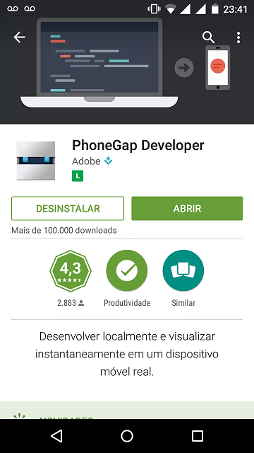
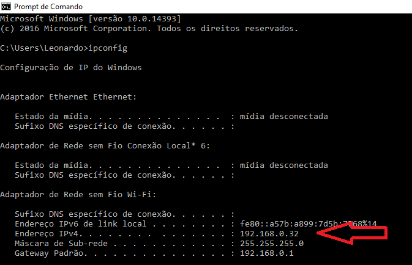
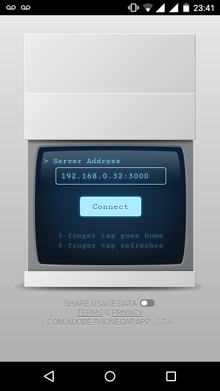

# Como instalar PhoneGap App (Android)

### 1. Execute seu projeto pelo WebStorm e tenha certeza que ele está funcionando no `localhost:3000`

Em caso de dúvidas, acesse o [Manual de Instalação do PhoneGap](../docs/instalar-phonegap.md)

## 2. Instale o App

## 3. Descubra o Endereço IPv4 do seu computador com o comando `ipconfig`

  No print o endereço IPv4 aparece em "Adaptador de Rede sem Fio Wi-Fi, pois estava conectado no Wi-Fi.
  Se Estiver conectado através de cabo, o endereço IPv4 aparecerá em "Adaptador Ethernet"

## 4. Com o aplicativo já aberto, escreva o seu endereço IPv4 e depois a porta `:3000` (Ex.: 192.168.0.32:3000)

   É importante lembrar que a porta `:3000` é referente ao `localhost:3000` criado pelo WebStorm. Se o seu projeto não estiver funcionando no localhost:3000 por algum motivo, não irá conseguir acessar dessa forma pelo App.
   
## 5. Clique em `Conect`. Após alguns segundos o App irá abrir o `index.html` do seu projeto. 
